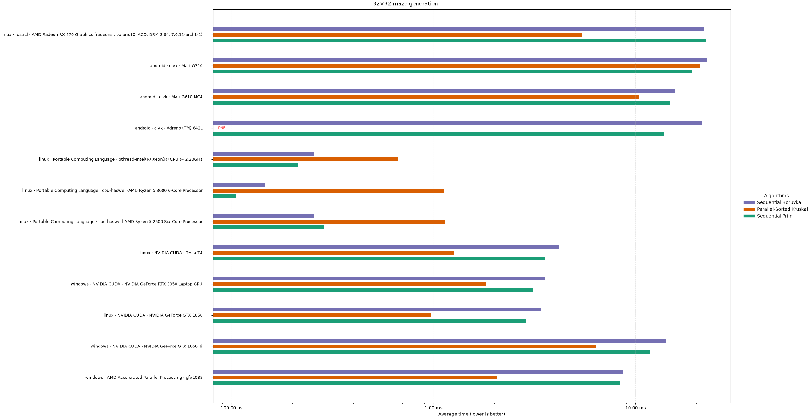
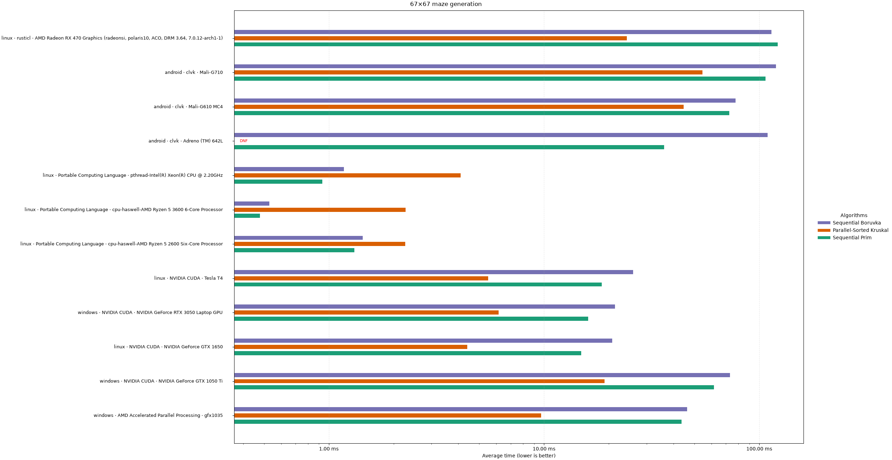
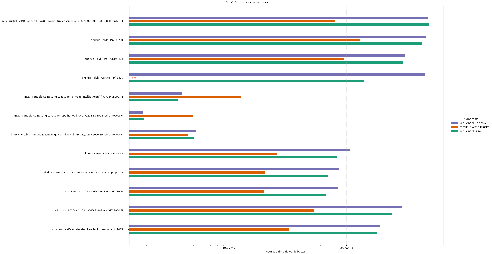
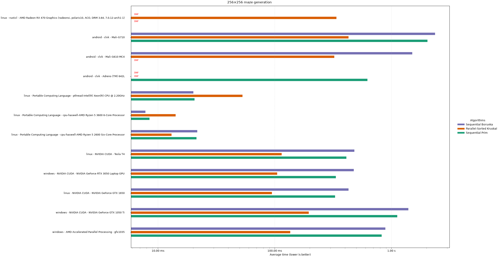
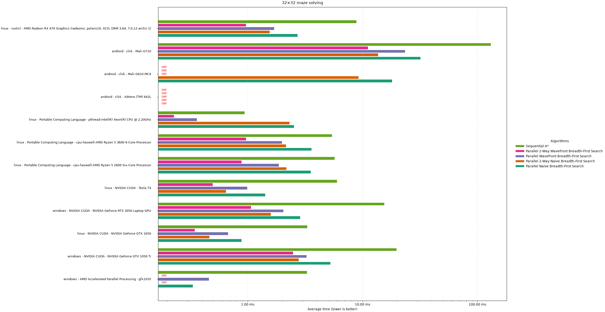
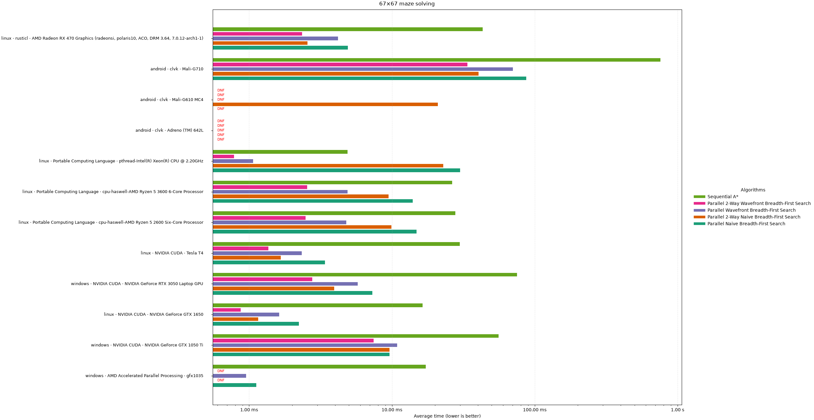
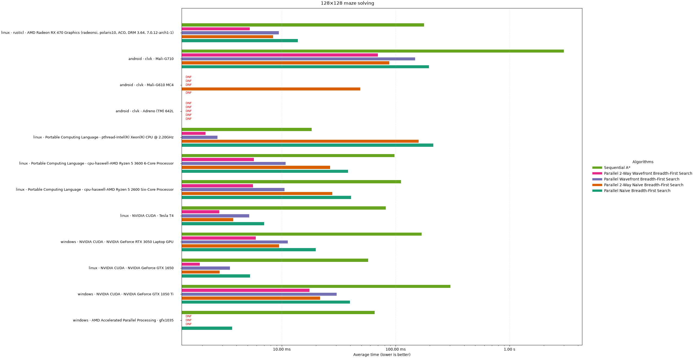
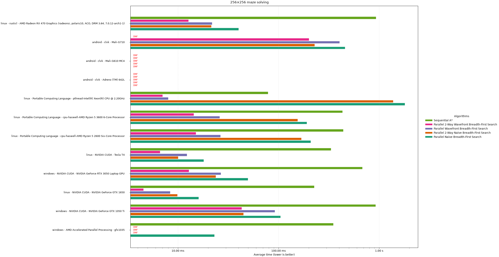

# Path finding in a Maze

## Maze generation

The generated maze is a minimum spanning tree. The edge weights are computed dynamically by a `weight` function from the coordinates of the neighboring cells and a seed. We have found that our weight function is not biased, generating a true random maze.

### Prim

We initially implemented a sequential Prim algorithm on the GPU. Unfortunately, Prim's algorithm is sequential, and not easily parallelizable. For larger sizes, it takes seconds to generate a maze.

### Boruvka

We then implemented sequential Boruvka on the GPU. We intended to parallelize this algorithm later, however, we ran out of time, and didn't end up implementing a parallel Boruvka on the GPU. For larger sizes, it also takes seconds to generate a maze, albeit in most cases, it's faster than Prim by a couple of %.

### Kruskal

We implemented a parallel-sorted Kruskal algorithm on the GPU. The Kruskal algorithm remains sequential, but the edges are sorted using parallel bironic merge sort.

The bottleneck here remains the sequential Kruskal algorithm after the parallel sorting step. On a 256x256 maze, I can clearly hear this through my AMD Radeon RX 470's coil whine.

Despite the bottleneck, the parallel bironic merge sort is fast enough on both integrated and dedicated graphics cards to beat both Prim and Boruvka. However, most CPUs excel at single-thread performance, which can be seen on the graphs.

This maze generator is noticeably faster than the previous two, and can generate larger mazes in a resonable time. This is the only maze generator that successfully completed the benchmark on my AMD Radeon RX 470, because the driver terminated the other two for running too long.

Introducing a private variable for multiple instances of `e[i]` ended up gaining us about a 5% performance boost on an AMD Radeon RX 470.

## Maze solving

### Naive parallel BFS

We initially implemented a naive parallel BFS solver on the GPU: in each iteration, every cell checks its neighbors whether it should become a frontier.

### Naive 2-way parallel BFS

Then we started the search from both the starting cell and the final cell. This signficantly and consistently sped up the performance across all benchmarks.

### Wavefront parallel BFS

We implemented an optimization over the naive parallel BFS: by using wavefront lists, and dispatching less, unnecessary kernels in parallel. This beats naive parallel BFS, especially on CPUs with way less cores than a GPU.

### Wavefront 2-way parallel BFS

The wavefront parallel BFS can also be run from the end, further improving performance.

### Sequential A*

The sequential A* has abysmal performance. We had to use logarithmic scale so as other algorithms even show up on the chart. Only a virtualized Xeon processor could beat the other algorithms.

## Performance Analysis

We have evaluated the performance of multiple maze generator and solver algorithms on multiple maze sizes on multiple operating systems, drivers, and hardware.

The average time it takes to generate a maze can be seen on the figures below. The intended sample size is 256, after 256 rounds of warmup. Only the kernel execution time is measured (not buffer reads or writes), and measured as the difference between `CL_PROFILING_COMMAND_END` and `CL_PROFILING_COMMAND_START`.

## Technical difficulties

Interestingly, we could get the benchmark to work on Android using Termux and clvk, however, it wasn't very stable: many test cases crashed before achieving the intended sample size.

Not all GPUs in Android devices were created equal:

* The Mali G710 finished the most maze generation benchmarks
* The Adreno 642L failed all parallel benchmarks

My AMD Radeon RX 470 has a limit of 2 seconds before the rusticl driver aborts the program.

When trying to allocate too much local space, the AMD Radeon RX 470 has reset itself and corrupted the image presented on the monitor, forcing me to reboot.
